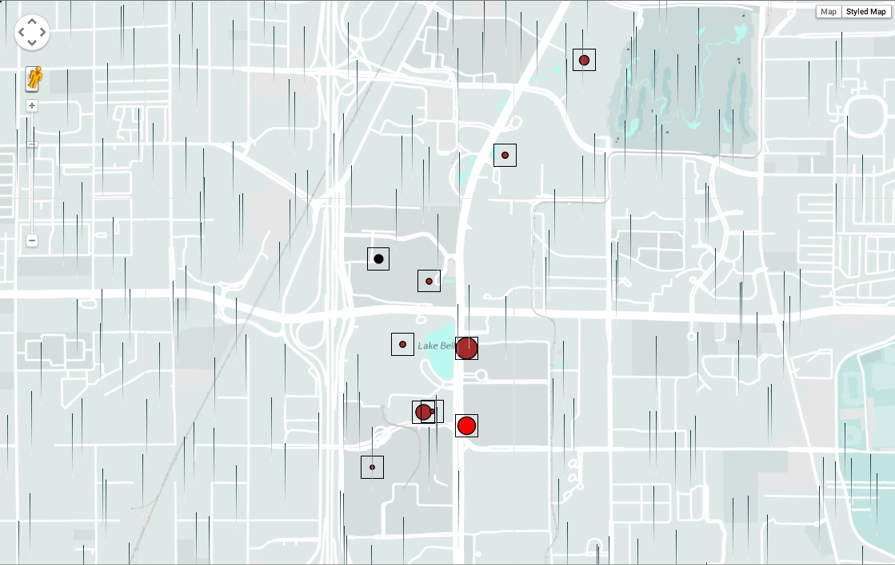

# Yelp / Weather Hackathon

# Discussion Questions

## Data

1. Review count, and negative/positive reviews may be affected by weather for businesses. There may be more positive reviews when the weather is really nice out, or vice versa.
2. No
3. You could possibly predict the weather based on the reviews found in the Yelp dataset.

## Method

1. Temperature, time, review count
2. You could find keywords that may correlate with the trends in the weather dataset

## Bias

1. Yelp dataset only has information for three cities.
2. You'd only be able to get positive reviews
3. We would state that the dataset sample is not representative of its population.

# Objective 1

Rainy
3/10,3/11,4/23,4/24,4/25

Sunny
2/8, 2/10, 2/15, 2/21, 2/23, 2/24

1.
2.
3.
4.
5.

# Objective 2

1. The businesses could all be put on a map, where size of the circle represents number of the reviews and color of the circle is average review. A new map could be created for each day, and the visualization would update the map for each day, sort of like a time lapse. To represent the weather, there could be storm clouds at the top of the visualization representing rain, or sun rays representing sunshine, etc.

2. It's not enough to simply show the businesses with number of reviews for each of the selected days because we're trying to find correlations with weather, so the weather also has to be tied into the visualization.

# Objective 3

The visualization would involve putting each business on a map. The size of the circle would represent review count for that day, while the color would represent average review. An overlay would illustrate the weather for that. For example, there would be a rain overlay for days with rain, snow for snowy days, or sun rays for a sunny day. The visualization could lapse between days or allow selection of days a user is interested in viewing.

I don't know about, but nothing warms me up better than some hot cocoa. For me, that's Usher dancing shirtless in one of his music videos. The next best thing is a fresh cup from your local coffee shop! Data research has shown that on cold days in the area, there is an influx of yelp reviews for local Coffee shops in Madison. Futhermore, these increased reviews are also generally more positive (4 to 5 stars). 

[Tell your story!  Link your graphics!]

# Objective 4

[Do it again!]

