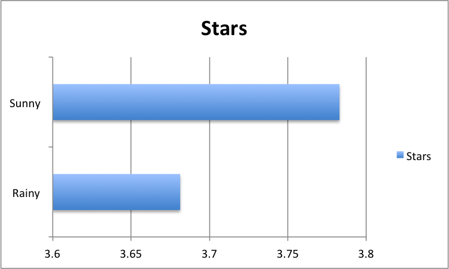
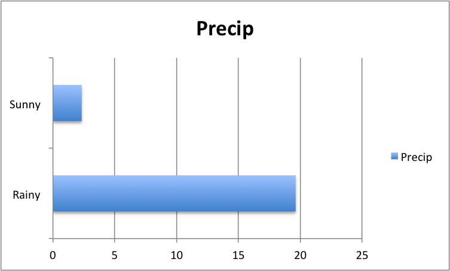

# Yelp / Weather Hackathon

# Objective 1

### Rating average - sunny

```javascript
> db.reviews.aggregate({$match:{"date":{$in: ["2010-07-04","2010-07-05","2010-07-06","2010-07-19","2010-07-24"]}}}, {$group:{_id:"$date", avg: {"$avg": "$stars"}}})
{ "_id" : "2010-07-19", "avg" : 3.58739837398374 }
{ "_id" : "2010-07-06", "avg" : 3.729528535980149 }
{ "_id" : "2010-07-04", "avg" : 3.763779527559055 }
{ "_id" : "2010-07-24", "avg" : 3.641304347826087 }
{ "_id" : "2010-07-05", "avg" : 3.684596577017115 }
```

### Rating average - rainy

```javascript
> db.reviews.aggregate({$match:{"date":{$in: ["2010-07-22", "2010-06-23", "2010-07-15", "2010-08-13", "2010-06-27"]}}}, {$group:{_id:"$date", avg: {"$avg": "$stars"}}})
{ "_id" : "2010-07-15", "avg" : 3.9328358208955225 }
{ "_id" : "2010-06-27", "avg" : 3.7422680412371134 }
{ "_id" : "2010-08-13", "avg" : 3.8350515463917527 }
{ "_id" : "2010-06-23", "avg" : 3.63323782234957 }
{ "_id" : "2010-07-22", "avg" : 3.771505376344086 }
```

### Precipitation sum - rainy

```javascript
> db.precip.aggregate([{"$match":{"DATE":{$regex:/20100722/}}},{"$group":{"_id":"$STATION","total_precip":{"$sum":"$HPCP"}}}])
{ "_id" : "COOP:474961", "total_precip" : 361 }
> db.precip.aggregate([{"$match":{"DATE":{$regex:/20100623/}}},{"$group":{"_id":"$STATION","total_precip":{"$sum":"$HPCP"}}}])
{ "_id" : "COOP:474961", "total_precip" : 187 }
> db.precip.aggregate([{"$match":{"DATE":{$regex:/20100715/}}},{"$group":{"_id":"$STATION","total_precip":{"$sum":"$HPCP"}}}])
{ "_id" : "COOP:474961", "total_precip" : 186 }
> db.precip.aggregate([{"$match":{"DATE":{$regex:/20100813/}}},{"$group":{"_id":"$STATION","total_precip":{"$sum":"$HPCP"}}}])
{ "_id" : "COOP:474961", "total_precip" : 147 }
> db.precip.aggregate([{"$match":{"DATE":{$regex:/20100627/}}},{"$group":{"_id":"$STATION","total_precip":{"$sum":"$HPCP"}}}])
{ "_id" : "COOP:474961", "total_precip" : 100 }
```

### Precipitation sum - sunny

```javascript
> db.precip.aggregate([{"$match":{"DATE":{$regex:/20100704/}}},{"$group":{"_id":"$STATION","total_precip":{"$sum":"$HPCP"}}}])
{ "_id" : "COOP:474961", "total_precip" : 0 }
> db.precip.aggregate([{"$match":{"DATE":{$regex:/20100705/}}},{"$group":{"_id":"$STATION","total_precip":{"$sum":"$HPCP"}}}])
{ "_id" : "COOP:474961", "total_precip" : 32 }
> db.precip.aggregate([{"$match":{"DATE":{$regex:/20100706/}}},{"$group":{"_id":"$STATION","total_precip":{"$sum":"$HPCP"}}}])
{ "_id" : "COOP:474961", "total_precip" : 0 }
> db.precip.aggregate([{"$match":{"DATE":{$regex:/20100719/}}},{"$group":{"_id":"$STATION","total_precip":{"$sum":"$HPCP"}}}])
{ "_id" : "COOP:026481", "total_precip" : 0 }
{ "_id" : "COOP:474961", "total_precip" : 2 }
> db.precip.aggregate([{"$match":{"DATE":{$regex:/20100724/}}},{"$group":{"_id":"$STATION","total_precip":{"$sum":"$HPCP"}}}])
{ "_id" : "COOP:474961", "total_precip" : 80 }
```

### Temperature - rainy

```javascript
db.precip.aggregate([{$match:{"DATE":{$regex:/20100722.*/}, "STATION_NAME":"MADISON DANE CO REGIONAL AIRPORT WI US"}}, {$group:{"_id": null, prec: {"$avg":"$HLY-TEMP-NORMAL"}}}])
{ "_id" : null, "prec" : 724.25 }

db.precip.aggregate([{$match:{"DATE":{$regex:/20100623.*/}, "STATION_NAME":"MADISON DANE CO REGIONAL AIRPORT WI US"}}, {$group:{"_id": null, prec: {"$avg":"$HLY-TEMP-NORMAL"}}}])
{ "_id" : null, "prec" : 702.2083333333334 }

db.precip.aggregate([{$match:{"DATE":{$regex:/20100715.*/}, "STATION_NAME":"MADISON DANE CO REGIONAL AIRPORT WI US"}}, {$group:{"_id": null, prec: {"$avg":"$HLY-TEMP-NORMAL"}}}])
{ "_id" : null, "prec" : 725.6666666666666 }

db.precip.aggregate([{$match:{"DATE":{$regex:/20100813.*/}, "STATION_NAME":"MADISON DANE CO REGIONAL AIRPORT WI US"}}, {$group:{"_id": null, prec: {"$avg":"$HLY-TEMP-NORMAL"}}}])
{ "_id" : null, "prec" : 699.0833333333334 }

db.precip.aggregate([{$match:{"DATE":{$regex:/20100627.*/}, "STATION_NAME":"MADISON DANE CO REGIONAL AIRPORT WI US"}}, {$group:{"_id": null, prec: {"$avg":"$HLY-TEMP-NORMAL"}}}])
{ "_id" : null, "prec" : 708.125 }
```

### Temperature - sunny

```javascript
> db.precip.aggregate([{$match:{"DATE":{$regex:/20100704.*/}, "STATION_NAME":"MADISON DANE CO REGIONAL AIRPORT WI US"}}, {$group:{"_id": null, prec: {"$avg":"$HLY-TEMP-NORMAL"}}}])
{ "_id" : null, "prec" : 711.875 }

> db.precip.aggregate([{$match:{"DATE":{$regex:/20100705.*/}, "STATION_NAME":"MADISON DANE CO REGIONAL AIRPORT WI US"}}, {$group:{"_id": null, prec: {"$avg":"$HLY-TEMP-NORMAL"}}}])
{ "_id" : null, "prec" : 712.0416666666666 }

> db.precip.aggregate([{$match:{"DATE":{$regex:/20100706.*/}, "STATION_NAME":"MADISON DANE CO REGIONAL AIRPORT WI US"}}, {$group:{"_id": null, prec: {"$avg":"$HLY-TEMP-NORMAL"}}}])
{ "_id" : null, "prec" : 713.7916666666666 }

> db.precip.aggregate([{$match:{"DATE":{$regex:/20100719.*/}, "STATION_NAME":"MADISON DANE CO REGIONAL AIRPORT WI US"}}, {$group:{"_id": null, prec: {"$avg":"$HLY-TEMP-NORMAL"}}}])
{ "_id" : null, "prec" : 725.2916666666666 }

> db.precip.aggregate([{$match:{"DATE":{$regex:/20100724.*/}, "STATION_NAME":"MADISON DANE CO REGIONAL AIRPORT WI US"}}, {$group:{"_id": null, prec: {"$avg":"$HLY-TEMP-NORMAL"}}}])
{ "_id" : null, "prec" : 722.625 }
```

# Objective 2

1. Bar chart, Scatterplot, coloring of datapoints based on weather 
2. Histogram, Pie Chart


# Objective 3

[Tell your story!  Link your graphics!]


-D3 Graph http://jsfiddle.net/27z35g64/4/

# Objective 4

[Do it again!]


